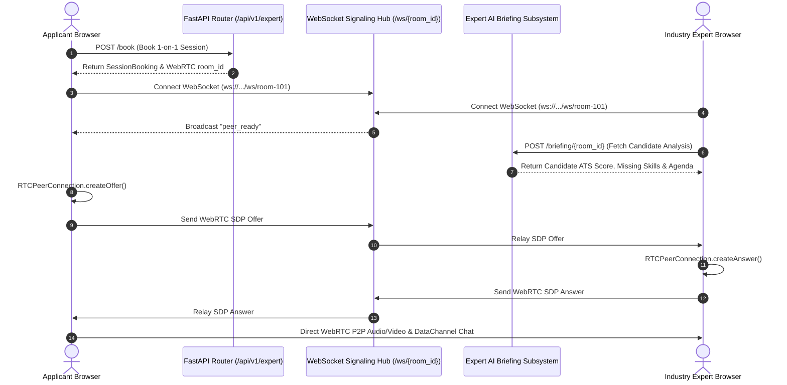

# CareerPulse: 1-on-1 Live Expert Interaction System Architecture

This document provides a comprehensive specification and implementation guide for the **1-on-1 Live Expert Interaction System** in **CareerPulse**. 

The system enables applicants to connect directly with verified industry experts (Principal Architects, Staff Engineers, VPs of Engineering) for real-time video/audio career advice, portfolio reviews, and mock technical system design sessions.

---

## 1. System Philosophy & Architecture Strategy

In alignment with CareerPulse's modern real-time capabilities and local AI intelligence, the 1-on-1 interaction system is built using **Custom WebRTC Peer-to-Peer (P2P)** media streaming coupled with **FastAPI Native WebSockets** for signaling.

### Key Technical Pillars

1. **Zero External Media Fees & Low Latency**:
   - Media streams (audio and video) flow directly peer-to-peer between the applicant's browser and the expert's browser via native `RTCPeerConnection`.
   - Audio/video data does not pass through external cloud CPaaS servers (e.g., Twilio or Daily.co).

2. **FastAPI WebSocket Signaling Hub**:
   - Manages room creation, presence detection, and real-time exchange of WebRTC SDP Offers, SDP Answers, and ICE Candidates.
   - Handled via `ws://localhost:8000/api/v1/expert/ws/{room_id}`.

3. **AI Expert Briefing Dossier**:
   - Before or during the live call, the system automatically synthesizes the applicant's latest CareerPulse analysis—including candidate resume context, SBERT ATS match scores, missing skill gaps, and Qwen 2.5 LLM roadmaps—into an **AI Intelligence Dossier** for the expert.

---

## 2. Component Diagram & Data Flow



---

## 3. Subsystem Breakdown

### A. Backend Architecture & Modules

1. **Schemas (`core_engine/expert_session/schemas.py`)**:
   - `ExpertProfile`: Expert metadata (name, designation, company, domain, bio, ratings, avatar URL).
   - `BookingRequest` & `SessionBooking`: Session scheduling details, room credentials, status lifecycle (`confirmed`, `active`, `completed`).
   - `ExpertAIBriefing`: Structure of the synthesized AI dossier presented to the expert.

2. **Service Subsystem (`core_engine/expert_session/service.py`)**:
   - `ExpertSessionService`: Handles expert directory retrieval, booking creation, room generation, and AI briefing compilation from analysis context.

3. **Router & WebSocket Signaling Gateway (`core_engine/expert_session/router.py`)**:
   - `ConnectionManager`: Manages active WebSocket connections grouped by `room_id`.
   - Relays `offer`, `answer`, `ice_candidate`, `chat_message`, and `hangup` payloads to peers.
   - REST Routes:
     - `GET /api/v1/expert/list`: List verified experts.
     - `POST /api/v1/expert/book`: Create session booking.
     - `GET /api/v1/expert/booking/{identifier}`: Fetch session info.
     - `POST /api/v1/expert/briefing/{room_id}`: Synthesize AI briefing dossier.
     - `WebSocket /api/v1/expert/ws/{room_id}`: WebRTC P2P signaling connection.

---

### B. Frontend User Interface & Real-Time Media Engine

1. **HTML Live Stage (`web_interface/public/expert_call.html`)**:
   - **Video Viewport**: High-definition remote video stream feed with picture-in-picture local self-view.
   - **In-Call Control Bar**: Mute/Unmute audio, Toggle Camera, End Session controls.
   - **Side-Panel Tab System**:
     - **Tab 1 (AI Dossier)**: Displays candidate's ATS match score, verified skills, missing skill gaps, and AI-recommended discussion agenda points.
     - **Tab 2 (Live Chat)**: Real-time encrypted text chat stream over WebSocket/DataChannel.

2. **JavaScript WebRTC Engine (`web_interface/public/js/expert_call.js`)**:
   - Uses `navigator.mediaDevices.getUserMedia({ video: true, audio: true })`.
   - Configures `RTCPeerConnection` with STUN servers (`stun:stun.l.google.com:19302`).
   - Dynamically manages offer/answer negotiation, ICE candidates, and remote track rendering.
   - Communicates with `/api/v1/expert/briefing` to load the applicant's latest AI analysis context into the expert's sidebar.

---

## 4. How to Test & Launch the 1-on-1 Expert System

1. **Start the FastAPI Backend Engine**:
   ```bash
   uv run uvicorn core_engine.main:app --reload --port 8000
   ```

2. **Start the Frontend Web Interface**:
   ```bash
   cd web_interface
   npm run dev
   ```

3. **Initiate a 1-on-1 Session**:
   - Open `http://localhost:3000/dashboard.html` in your browser.
   - Click **"Start Live Session"** on the 1-on-1 Expert banner, or navigate directly to `http://localhost:3000/expert_call.html?room_id=room-demo-101`.
   - Open the same URL in a second browser window or tab to simulate the Industry Expert joining the P2P room.
   - Verify camera/microphone connection, live video feed, in-call chat, and the AI Dossier sidebar!
