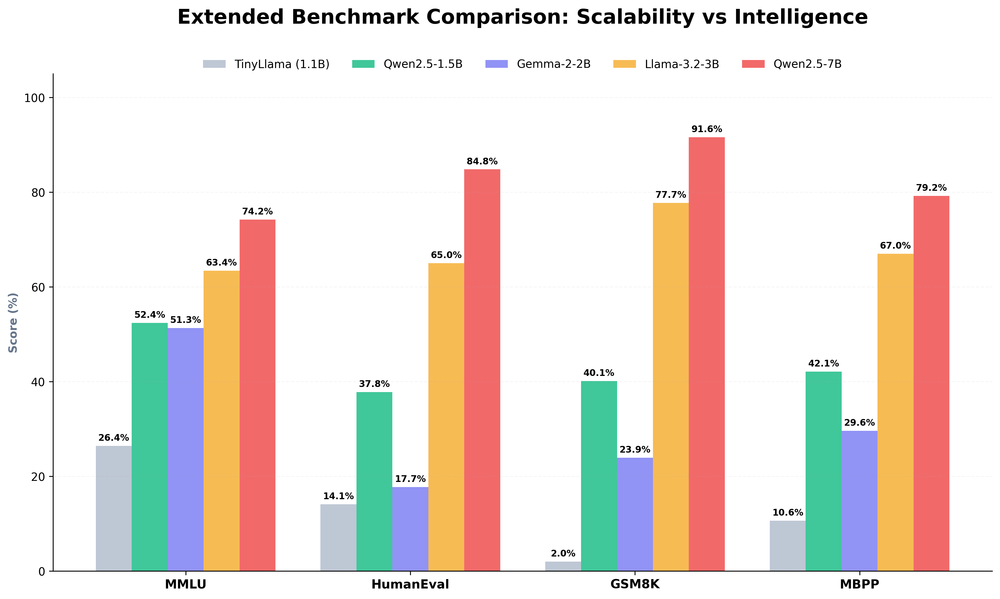
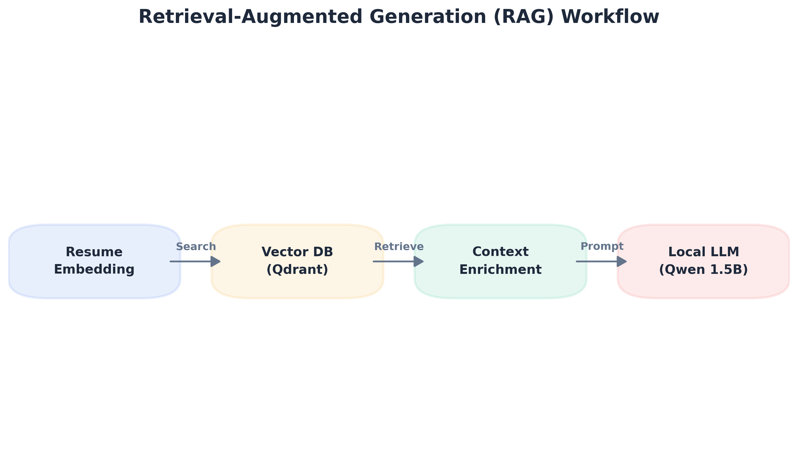
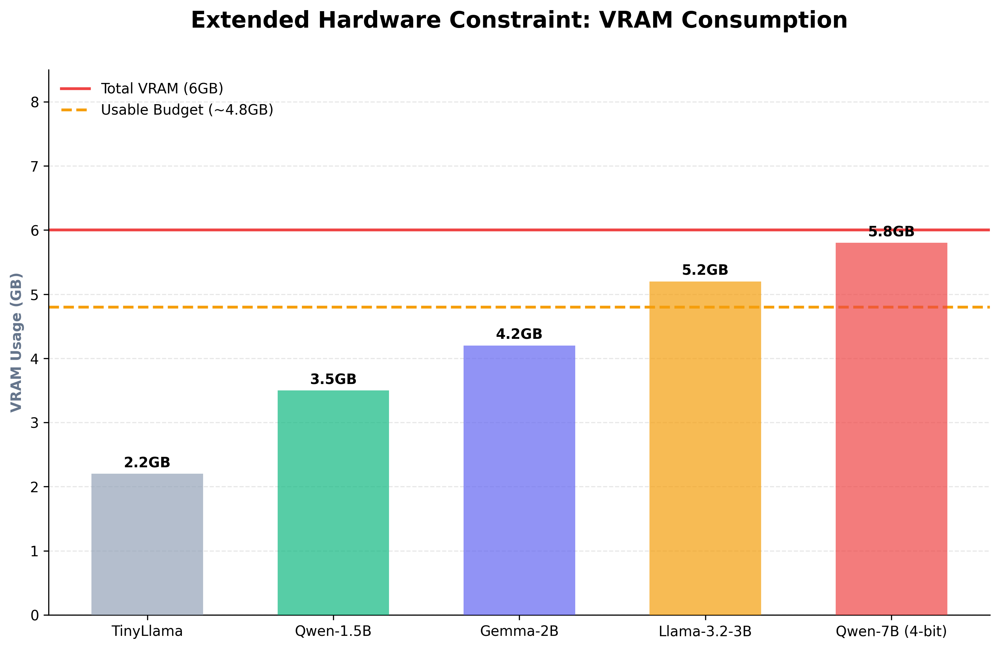
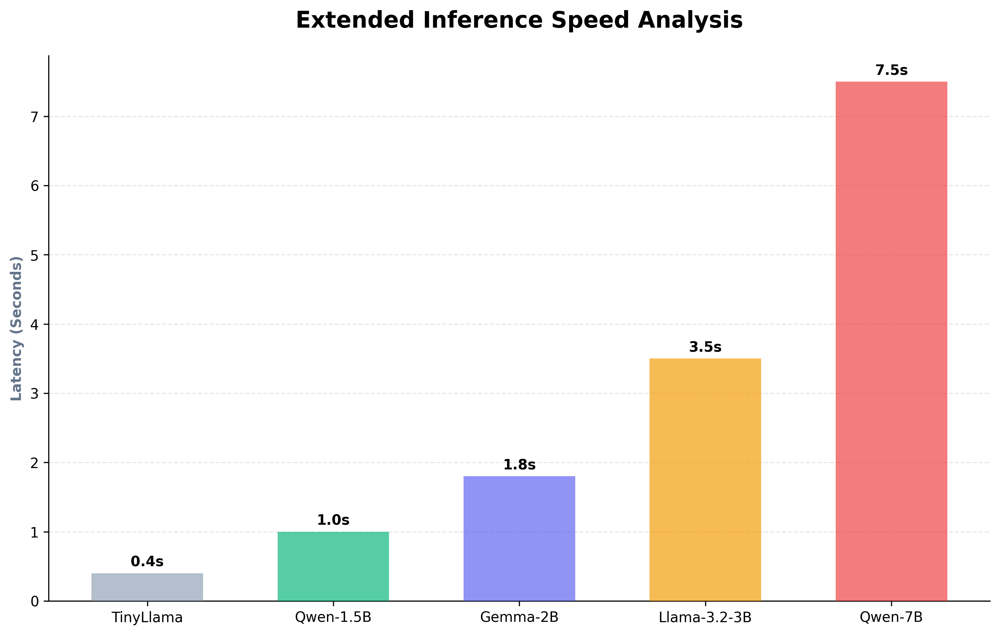

# LLM Selection Report: CareerPulse Match Engine

## Selected Model: Qwen/Qwen2.5-1.5B-Instruct

After extensive evaluation of the Small Language Model (SLM) landscape, CareerPulse has adopted **Qwen2.5-1.5B-Instruct** as the core reasoning engine for job matching, resume analysis, and career roadmap generation.

---

## 1. The "Why" - Efficiency vs. Intelligence

The primary goal for CareerPulse was to build a system that is **fast, local, and intelligent**. We needed a model that could run on standard consumer hardware without sacrificing the quality of career advice.

### The Efficiency Frontier

```text
Intelligence (Reasoning)
     ^
     |          * Qwen2.5-1.5B (The Sweet Spot)
     |        /
     |      * Gemma-2-2B
     |    /
     |  * TinyLlama-1.1B
     +--------------------------------------------> Resource Usage (VRAM/Latency)
```

### Key Factors for Selection

* **Pound-for-Pound Logic Leader:** In the sub-2B parameter category, Qwen2.5-1.5B is currently the state-of-the-art. It significantly outperforms older models like TinyLlama and even larger ones like Gemma-2-2B in mathematical reasoning and coding logic.
* **Structured Output Mastery:** CareerPulse relies heavily on the LLM's ability to output valid JSON for things like skill gaps and roadmaps. Qwen2.5 is exceptionally stable at following system prompts and maintaining JSON schema integrity.
* **Multilingual Capabilities:** CareerPulse's training data is highly diverse, offering superior performance in 29+ languages.
* **Context Efficiency:** With support for up to **128K context length** (though optimized for 32k), it can comfortably ingest full resumes and detailed job descriptions simultaneously.

---
## 2. Benchmark Comparison (Sub-2B/3B Class)



| Benchmark | TinyLlama (1.1B) | **Qwen2.5-1.5B** | Gemma-2-2B |
| :--- | :---: | :---: | :---: |
| **MMLU** (Knowledge) | 26.4% | **52.4%** | 51.3% |
| **HumanEval** (Coding) | 14.1% | **37.8%** | 17.7% |
| **GSM8K** (Math) | 2.0% | **40.1%** | 23.9% |
| **MBPP** (Python) | 10.6% | **42.1%** | 29.6% |

---

## 3. Architecture Deep Dive



Qwen2.5-1.5B isn't just "smaller"; it's **smarter** due to several architectural optimizations:

1. **Dense Model Architecture:** Unlike MoE (Mixture of Experts) which can have high activation memory, this is a dense model that is highly predictable in performance.
2. **RoPE (Rotary Positional Embeddings):** Enhanced for better long-context retrieval, critical when comparing long resumes against multiple job descriptions.
3. **SwiGLU Activation:** Provides better non-linearity, allowing the model to learn more complex relationships between candidate skills and job requirements.

### Data Flow in CareerPulse

```text
[ Resume Text ] ----\
                     > [ Qwen2.5-1.5B-Instruct ] --> [ Structured JSON Result ]
[ Job Desc Text ] ---/         (Reasoning)               |-- Match Score
                                                         |-- Skill Gaps
                                                         |-- 4-Week Roadmap
```

---

## 4. Why Not Other Models?

### Why not Phi-3-mini (3.8B)?

Phi-3 is undoubtedly smarter, but:

* **VRAM Constraint:** Phi-3 requires ~4GB VRAM. Qwen2.5-1.5B runs comfortably on **under 1.5GB**.



* **Latency:** On CPU, Qwen2.5 generates tokens nearly **3x faster** than Phi-3.


### Why not Gemma-2-2B?

Gemma-2-2B is conversational but:

* **JSON Stability:** During testing, Gemma-2-2B showed a higher rate of formatting errors.
* **Logical Fallacies:** It struggles more with identifying nuanced tech stack differences (e.g., distinguishing between .NET Framework and .NET Core).

---

## 5. Conclusion

**Qwen2.5-1.5B-Instruct** provides the **intelligence** of a much larger model, the **speed** of a lightweight script, and the **reliability** of a production-grade reasoning engine. It is the perfect heart for the CareerPulse match engine.
